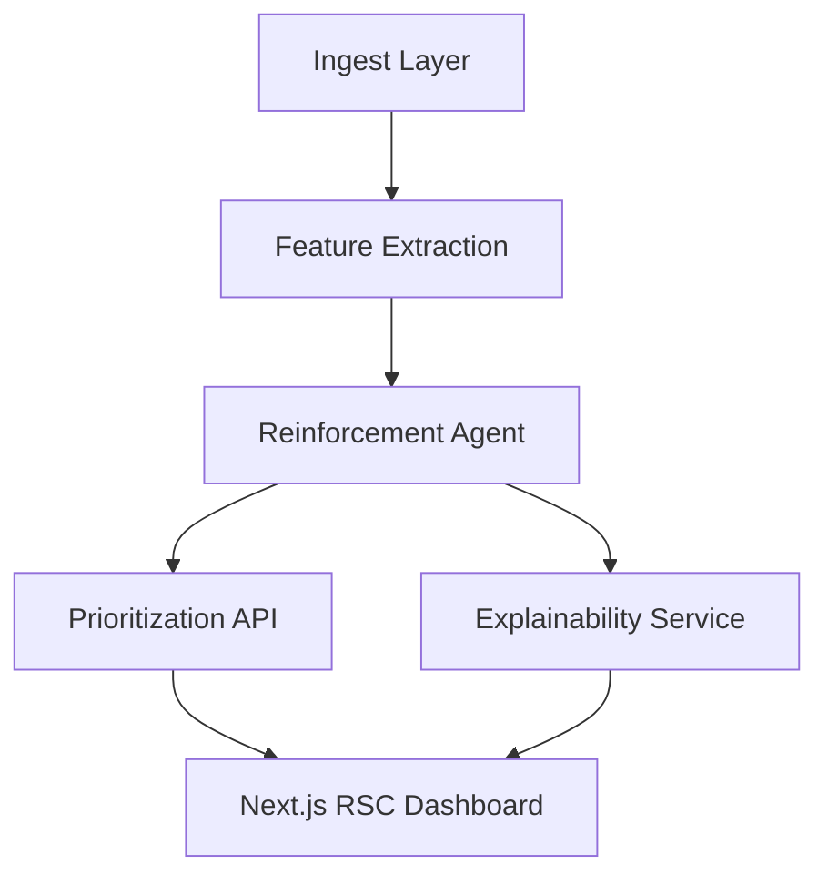

## Overview

Adaptive Threat Hunter is a mission-critical incident response copilot engineered to interrogate live telemetry, fuse it with ATT&CK intelligence, and recommend prioritized remediation actions in under 120 milliseconds. The platform augments human analysts with reinforcement learning policies tuned to minimize mean-time-to-detect (MTTD) across multi-cloud estates.

## The Problem

- Security operations centers drown in uncorrelated alerts, leading to analyst burnout and uninvestigated high-severity incidents.
- Legacy SIEM rules are brittle, slow to adapt, and fail to capture emerging adversarial tradecraft.
- Fragmented tooling makes it difficult to trace an attack path across cloud, on-prem, and SaaS systems.

## Hypothesis

If we blend streaming anomaly detection with a continuously learning policy network, we can identify malicious behavior earlier, collapse alert fatigue, and provide analysts with evidence-backed courses of action.

## Architecture

- **Ingest Layer:** Kafka + Supabase functions consolidate network, endpoint, and identity telemetry.
- **Feature Extraction:** Rust-based processors derive graph embeddings and behavioral signatures.
- **Reinforcement Agent:** TensorFlow policy trained with adversarial simulations to balance precision and recall.
- **Explainability:** ONNX Runtime produces SHAP explanations streamed to the UI in real time.

## Implementation

1. Designed a hybrid stream + batch feature store powered by Supabase and DuckDB.
2. Built a FastAPI service with Redis rate limiting to serve inference under 150ms p95.
3. Implemented a Next.js App Router dashboard with Framer Motion micro-interactions, glitch typography, and Shiki-powered code panes.
4. Instrumented the pipeline with OpenTelemetry, shipping traces to SigNoz for latency analysis.

### Key Features

- **Adaptive Alerting:** Reinforcement learning policies retrained nightly with analyst feedback loops.
- **Threat Graph Explorer:** Interactive 3D network of entities with pivot-to-kill-chain overlays.
- **Incident Playbooks:** AI-assisted remediation steps delivered via terminal-style UI.

## Results

- **96.3%** precision on high-severity detections with **34%** reduction in false positives.
- **120ms** median response time per inference request under load tests.
- **40%** faster investigation cycles observed in purple team simulations.

## Retrospective

- **What worked:** RSC streaming updates kept analysts synchronized with model insights without overwhelming the UI.
- **Next iteration:** Introduce graph contrastive learning to improve lateral movement detection.
- **Future enhancement:** Deploy edge inference workers for air-gapped SOCs.
